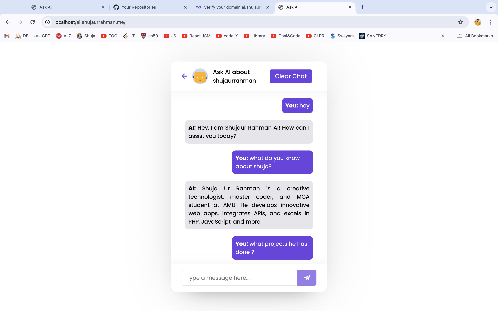
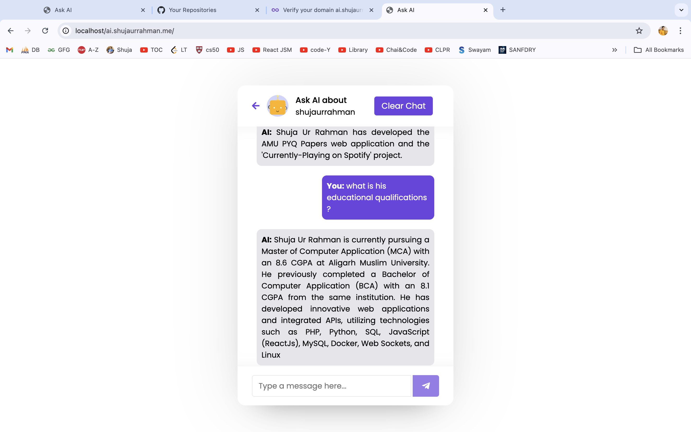

# AI Chat API

Welcome to the **AI Chat API** project! This API is designed to provide intelligent responses based on the context of the portfolio website of **Shujaur Rahman**. It utilizes the Vercel-hosted AI service as a proxy to fetch responses from the Hugging Face API, enhancing user interaction through tailored and relevant replies.

## Table of Contents

- [Overview](#overview)
- [Purpose](#purpose)
- [How It Works](#how-it-works)
- [API Endpoints](#api-endpoints)
  - [Chat Endpoint](#1-chat-endpoint)
  - [Contextual AI Response](#2-contextual-ai-response)
- [Future Improvements](#future-improvements)
- [Contributing](#contributing)
- [License](#license)
- [Contact](#contact)

## Overview

The **AI Chat API** is hosted at [ai.shujaurrahman.me](https://ai.shujaurrahman.me) and is focused on creating an interactive chat experience for users seeking information about Shujaur Rahman's work and expertise. The API employs a custom context defined in a JSON file to ensure the AI's responses are relevant and meaningful.

## Purpose

The primary goal of this API is to provide an engaging chat interface where users can ask questions and receive informative answers that reflect the knowledge and personality of Shujaur Rahman.

## How It Works

1. **User Input**: Users send messages to the API via a chat interface.
2. **Vercel Proxy**: The request is routed to the Vercel API, acting as a proxy to the Hugging Face AI model.
3. **AI Response**: The AI generates responses based on the user's input and the context provided in the JSON file.
4. **Return Response**: The generated response is sent back to the user through the chat interface.


<br>


## API Endpoints

### 1. Chat Endpoint

- **URL**: `https://ai-api-vert.vercel.app/api/chat`
- **Method**: `GET`
- **Query Parameters**:
  - `message`: The user's message (required).

#### Example Request

```http
GET https://ai-api-vert.vercel.app/api/chat?message=hey
```

#### Example Response

```json
{
  "message": "Hey, I am Shujaur Rahman AI! How can I assist you today?"
}
```

### 2. Contextual AI Response

The API provides responses within the context of the user's portfolio. The context is defined in the `combined.json` file, which can be enhanced over time to improve response quality.

#### Example Usage

1. **User Input**: The user sends a message like "Tell me about your projects."
2. **API Call**: The chat frontend makes a call to the Vercel API with the user's message.
3. **Response**: The API responds with information about Shujaur Rahman's projects.

## Future Improvements

This implementation is a prototype. Future enhancements will focus on:

- Refining the `combined.json` context for better AI responses.
- Fine-tuning the AI model to improve its conversational abilities.
- Adding more features and functionalities to the chat interface.

## Contributing

Contributions to improve the AI interface chat are welcome! If you have suggestions or find any issues, please create a pull request or open an issue in the repository.


## Contact

For inquiries or feedback, please reach out to:

- **Shuja ur Rahman**  
- Email: [discuss@shujaurrahman.me](mailto:shujaurrehman210@gmail.com)  
- Portfolio: [shujaurrahman.me](https://shujaurrahman.me)

---

Thank you for checking out this project!
